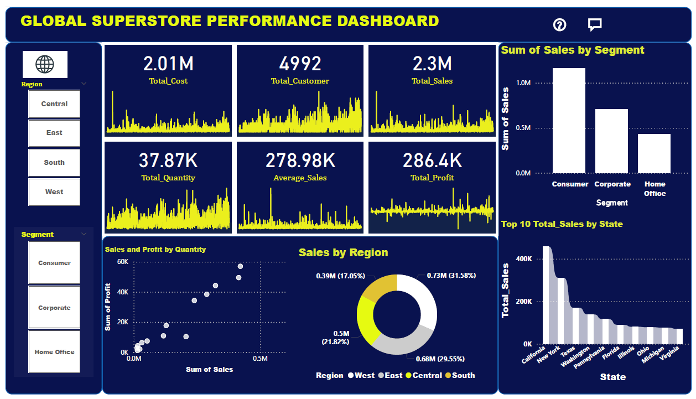

# Analysis-of-Regional-Sales-Performance-and-Market-Segmentation

## TABLE OF CONTENT

- [Introduction](#Introduction)

- [Data Description](#Data-Description)

- [Data Collection and Preparation](#Data-Collection-and-Preparation)

- [Data Analysis](#Data-Analysis)

- [Skills demonstrated](#Skills-demonstrated)

- [Visualizations](#Visualizations)

- [Insight from analysis](#Insight-from-analysis)

- [Summary of Analysis](#Summary-of-Analysis)

## Introduction:
Sales data plays a vital role in helping businesses understand performance across different markets. This study focuses on the Analysis of Regional Sales Performance and Market Segmentation using the Global Superstore dataset. The dataset contains information on customer transactions, product categories, sales revenue, discounts, and profit across various regions. By examining regional differences and customer segments: Consumer, Corporate, and Home Office. This analysis aims to identify sales trends, Cost trends ,Quantity Sold and  highlight profitable markets, and provide insights that can support better business decisions.

## Data Description: 
Global Superstore dataset is a  retail dataset that records sales transactions across different four regions.. It contains detailed information on customer purchases, product categories, shipping methods, and financial performance.
The key attributes in the dataset include:
 - **Order Details:** Order ID, Order Date, Ship Date, Ship Mode
 - **Customer Information:** Customer ID, Customer Name, Segment (Consumer, Corporate, Home Office), Country/Region, City, State, Postal Code, Region
 - **Product Information:** Product ID, Category, Sub-Category, Product Name
 - **Sales and Profitability Measures:**  Sales Revenue, Quantity Ordered, Discount Applied, Profit Earned
The dataset spans multiple years and covers customers from different geographical regions such as West, East, Central, and South, providing an opportunity to study regional sales performance and also the segmentation of customers into Consumer, Corporate, and Home Office enables analysis of market behavior and purchasing trends.

## Data Collection and Preparation
## Data Source
The dataset employed in this study is the Global Superstore dataset, a publicly available sample dataset widely used for research, academic projects, and business intelligence training. It was originally released by Tableau Software as a demonstration dataset for data visualization and analysis.
- [Download Global Superstore Dataset](Global_Superstore_Dataset_raw_file.csv)

### Tools used: Powerbi
    - Power Query Editor.
    - DAX
    - Explicit  Measure
    - Implicit Measure
    - Added card with states
    - Slicer
    
## Skills demonstrated
1. Data Cleaning, Preparation  and Transformation:
   (a)  Removing the duplicates
   (b). Removing the superfluous Column
          - Row_id
          - Postal code
    (c) Change the data type like Order Date, Ship Date
    (d) Calculating the measures
        - Total Sales -Total_Sales = SUM('Sample - Superstore'[Sales])
        - Total Profit - Total_Profit = SUM('Sample - Superstore'[Profit])
        - Total Quantity- Total_Quantity = SUM('Sample - Superstore'[Quantity])
        - Total Cost- Total_Cost = [Total_Sales]-[Total_Profit]
        - Average Sale - Average_Sales = AVERAGE('Sample - Superstore'[Sales])
        - Total Customer - Total_Customer = DISTINCTCOUNT('Sample - Superstore'[Customer Name])
   
## Data analysis
   - Total sales and Profit by Quantity
   - Total sales by Region
   - Total sales by Segment
   - Top 10 Total sales by State
   - Total Sales
   - Total Profit
   - Total Quantity
   - Total Cost
   - Average Sale
   - Total Customer

## Data visualization 
   To analyze Regional Sales Performance and Market Segmentation, several Power BI visualizations will be applied. Bar charts will be used to compare sales and profit across regions. Pie and stacked column charts will illustrate market segmentation by Customer type (Consumer, Corporate, Home Office).

## Insight from analysis:
  - Regional Sales Performance – Sales were not evenly distributed across regions. The West and East regions recorded higher sales and profit, while the South and Central regions showed weaker performance, with some orders generating losses.
  - Segment – The Consumer segment contributed the largest share of sales, followed by Corporate, while the Home Office segment recorded the lowest revenue.
  - Sales Trends – Seasonal fluctuations were noted, with peak sales occurring towards the end of the year, suggesting that promotions and holiday seasons significantly drive sales volume.

## Summary of Analysis
  - The analysis showed that sales and profit varied significantly across regions, with the West and East performing better than the South and Central. Among customer segments, the Consumer segment contributed the highest sales, while the Corporate segment showed stronger profit margins in some regions. Product analysis revealed that Technology items drove strong revenue, while Furniture often had lower profitability due to discounts and shipping costs. A clear negative impact of discounts on profit was also observed, alongside seasonal sales trends peaking at year-end.
  -

   
